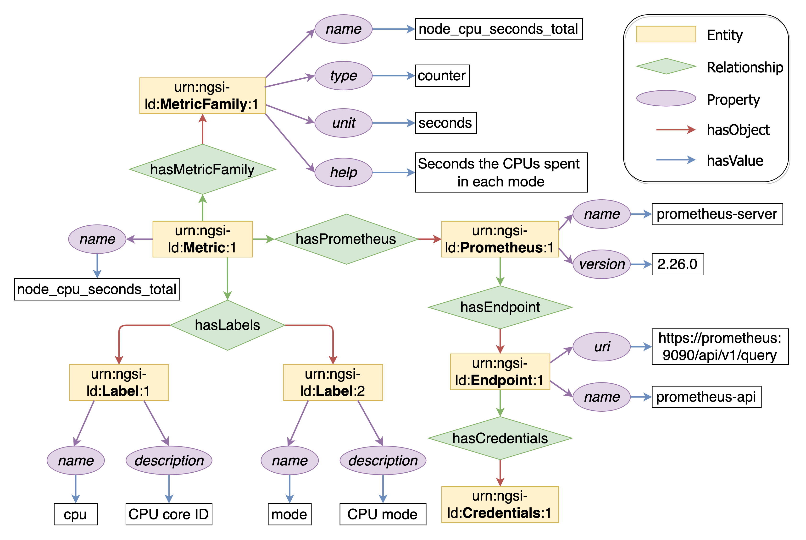
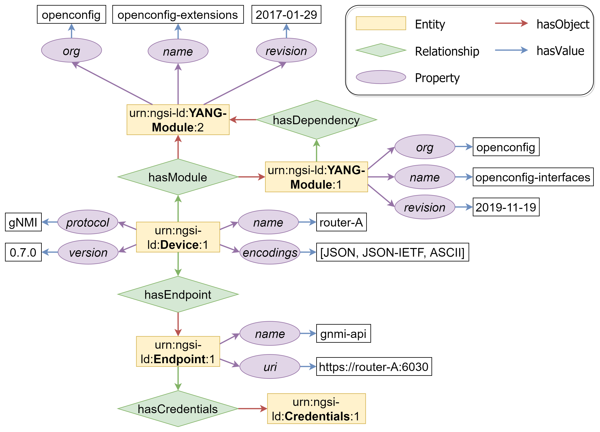
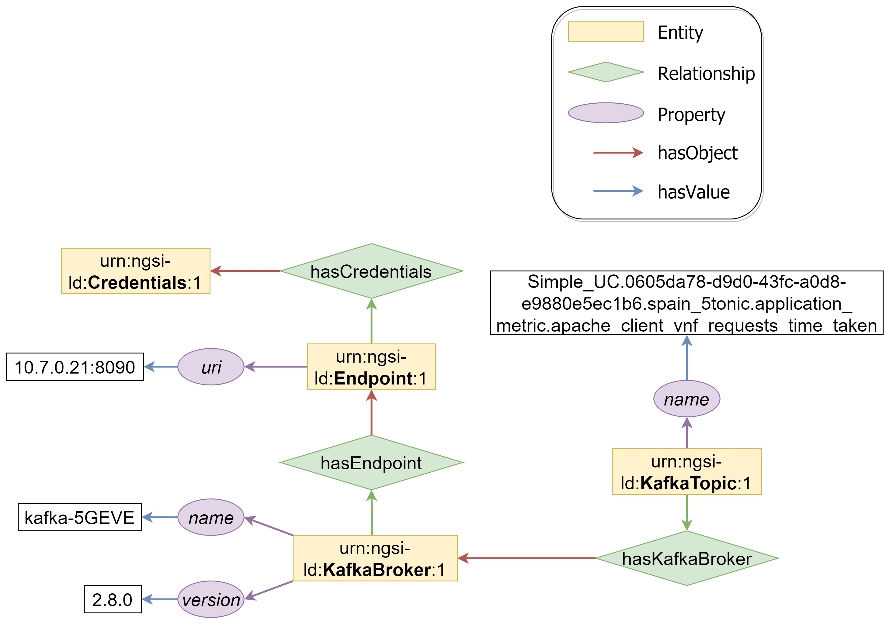
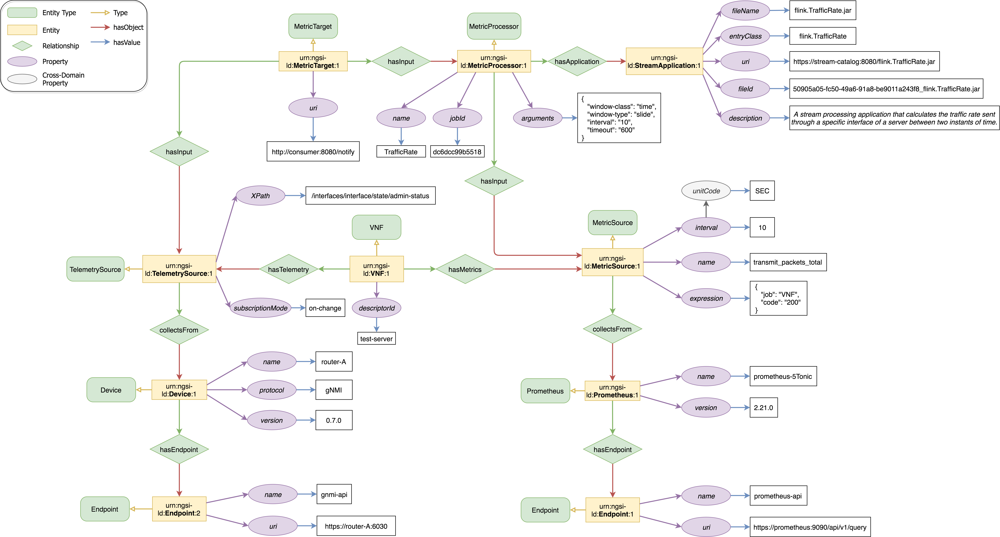
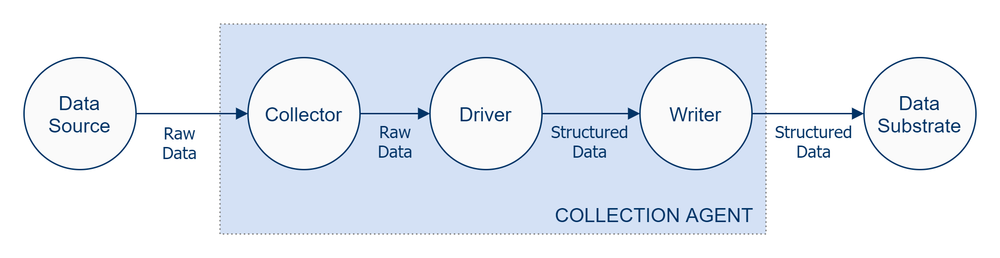
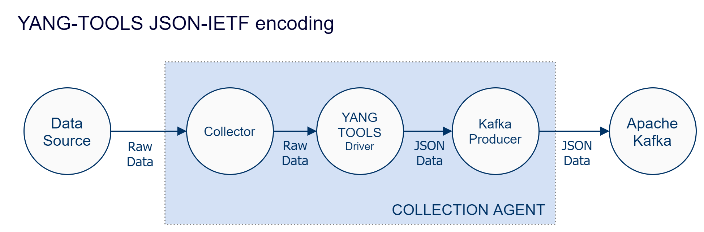

# Semantic Data Models

This repository contains NGSI-LD information models that characterize those data sources currently supported by the [semantic data aggregator (SDA)](https://github.com/giros-dit/semantic-data-aggregator).

# Pre-requisites (ONLY Windows users)

Window's implementation of Git does not support filenames longer than 260 characters ([see](https://stackoverflow.com/questions/22575662/filename-too-long-in-git-for-windows)). Before cloning this repository, it is required to run the following command in order to support longer filenames (requires admin privileges):
```bash
git config --system core.longpaths true
```

## Table of Contents

1. [NGSI-LD Information Models](#ngsi-ld-information-models)
2. [Data Models](#data-models)

## NGSI-LD Information Models

The ETSI CIM standards specify a framework for exchanging context information. As part of the specification, ETSI CIM introduces the NGSI-LD information models to represent the the context information.

This repository stores information models that describe the metadata associated to the different data sources and data consumers which are integrated with the semantic data aggregator. Such models can be found within [`docs`](docs) folder. This folder also includes some diagrams explaining design ideas for the project.

### Metric Data Source

Information model that describes a metric-based data source. More specifically, a Prometheus-based data source. Notice the `MetricFamily` entity, which is a concept characteristic of Prometheus (and OpenMetrics).



### Telemetry Data Source

Information model that describes a telemetry-based data source. This data source is represented by a telemetry service supported by a network device. Our current prototype focuses on gNMI, but other protocols such as NETCONF and RESTCONF can leverage this information model as well.



### Kafka Data Source

Information model that describes a Kafka-based data source. For now, the information model is pretty simple as only describes the Kafka broker and the endpoint associated to it. Kafka topic information is defined as part of the `EVESource` entity, which represents the configuration of a Kafka consumer for the 5GEVE use case. An example that uses such entity can be found [here](docs/information-models/data-sources/kafka/kafka-model-EVESource.png)



###  Metrics and Telemetry Information Model Diagram

The following figure depicts an example of a simplified information model that includes a Metric-based data source (i.e., Prometheus) along with a Telemetry-based data source (i.e., gNMI telemetry). Additionally, the diagram describes the data pipeline that is responsible for collecting data from these two source, aggregate the data through a stream processing application, and eventually, the delivery of the data to a data consumer (represented by the `MetricTarget` entity).



## Data Models

The role of the semantic data aggregator is the aggregation of data ingested from monitoring sources, and the transformation of the resulting data into a format that is suitable for those interested data consumers. For this purpose, the data aggregator follows a model-driven approach that establishes an agreement between data sources and data consumers.

### YANG Data Models

One of the goals in this project is to achieve interoperability by introducing data models that are agnostic to the input/output serialization format. To this end, we leverage the [YANG](https://tools.ietf.org/html/rfc7950) modeling language which enables the creation of data models that provide an abstraction layer over the underlying complexity of the technology that is used. YANG is a highly a descriptive and humand readable modeling language. YANG supports model evolution by means of augmentations and deviations, and enables differentiating configuration data from operational data.

The YANG language models data following a tree structure. Subscriptions to data sources that rely on YANG models, produce snapshots of the subscribed YANG tree at given time. These snapshots represent subtrees of the YANG tree that include those data nodes that match the criteria of the subscription (XPath, subtree filtering). Subscriptions can be configured to trigger notifications periodically or upon detecting changes on the data nodes. The concept of a YANG event notification is described in detail in [RFC 5227](https://tools.ietf.org/html/rfc5277).

We propose that the semantic data aggregator manages data internally as YANG event notifications. The notification includes an event time paremeter along with the subtree snapshot. A notification shall be encoded in a format such as XML (NETCONF) or Protobuf (gNMI). The semantic data aggregator must choose a performant encoding format for the YANG even notifications.

### Collection Agents

The integration of new data sources with the semantic data aggregator requires the configuration of a collection agents. These agents have to address the following two aspects:

1. **Transport**: Mechanism that collects data from the source. This mechanism could be either push-based or pull-based.
2. **Encoding**: Data is sent from the source in a particular format which may follow a structure. The agent must parse and transform the data into a format that is suitable for future consumption.

Regarding the encoding aspect, the collection agent leverages a special component called the `driver` which is reponsible for transforming the ingested events into a YANG data model. By "translating" the event into a YANG data model tree, the SDA is able to structure data using the encoding format of best interest such as Apache Avro or Protobuf. Notice here the use of the term `event`. Each YANG data model is specifically built to cope with individual events collected from a data source. Hence, the role of the `driver` is the transformation of data on an event basis. Beware that this approach requires the collection agent to include additional mechanisms to pre-process the ingested data in order to provide the `driver` with individual events.

Once the driver finishes the job, the collection agent applies the required mechanisms that write the encoded structured data in the Data Substrate, e.g., Kafka producer.

### Data Source Driver Implementation

In order to facilitate the adoption of new data sources, we propose a methodology for implementing the so-called data source drivers. The following figure depicts a first approach to this implementation:



The above shown approach is agnostic to the chosen tools. In the case of our current semantic data aggregator prototype, Apache NiFi, Apache Kafka, and JSON IETF encoding are the chosen pieces for building data source drivers:



Each data source driver is implemented with the [YANG-TOOLS](https://docs.opendaylight.org/en/stable-aluminium/developer-guide/yang-tools.html) Java library as custom NiFi processor. These drivers are built on Java class bindings that YANG-TOOLS generate for the YANG model(s) associated to each data source. The NiFi processor is responsible for normalizing the collected data by parsing the raw data from the source and producing data structured as per the associated YANG model. For the sake of interoperabiltiy, the produced data are encoded into the JSON IETF format.

#### How-to-develop-my-custom-driver (COMING SOON!)
